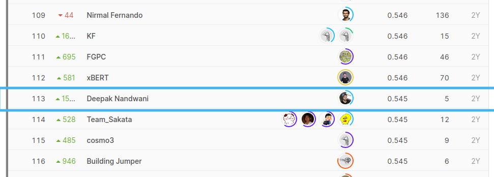

# 2019 Data Science Bowl
Uncover the factors to help measure how young children learn

# Ignite Possibilities.

Uncover new insights in early childhood education and how media can support learning outcomes. Participate in our fifth annual Data Science Bowl, presented by Booz Allen Hamilton and Kaggle.

PBS KIDS, a trusted name in early childhood education for decades, aims to gain insights into how media can help children learn important skills for success in school and life. In this challenge, you’ll use anonymous gameplay data, including knowledge of videos watched and games played, from the PBS KIDS Measure Up! app, a game-based learning tool developed as a part of the CPB-PBS Ready To Learn Initiative with funding from the U.S. Department of Education. Competitors will be challenged to predict scores on in-game assessments and create an algorithm that will lead to better-designed games and improved learning outcomes. Your solutions will aid in discovering important relationships between engagement with high-quality educational media and learning processes.

Data Science Bowl is the world’s largest data science competition focused on social good. Each year, this competition gives Kagglers a chance to use their passion to change the world. Over the last four years, more than 50,000+ Kagglers have submitted over 114,000+ submissions, to improve everything from lung cancer and heart disease detection to ocean health.

For more information on the Data Science Bowl, please visit www.DataScienceBowl.com

# Where does the data for the competition come from?

The data used in this competition is anonymous, tabular data of interactions with the PBS KIDS Measure Up! app. Select data, such as a user’s in-app assessment score or their path through the game, is collected by the PBS KIDS Measure Up! app, a game-based learning tool.

PBS KIDS is committed to creating a safe and secure environment that family members of all ages can enjoy. The PBS KIDS Measure Up! app does not collect any personally identifying information, such as name or location. All of the data used in the competition is anonymous. To view the full PBS KIDS privacy policy, please visit: pbskids.org/privacy.

No one will be able to download the entire data set and the participants do not have access to any personally identifiable information about individual users. The Data Science Bowl and the use of data for this year’s competition has been reviewed to ensure that it meets requirements of applicable child privacy regulations by PRIVO, a leading global industry expert in children’s online privacy.

# What is the PBS KIDS Measure Up! app?

In the PBS KIDS Measure Up! app, children ages 3 to 5 learn early STEM concepts focused on length, width, capacity, and weight while going on an adventure through Treetop City, Magma Peak, and Crystal Caves. Joined by their favorite PBS KIDS characters, children can also collect rewards and unlock digital toys as they play. To learn more about PBS KIDS Measure Up!, please click here.

PBS KIDS and the PBS KIDS Logo are registered trademarks of PBS. Used with permission. The contents of PBS KIDS Measure Up! were developed under a grant from the Department of Education. However, those contents do not necessarily represent the policy of the Department of Education, and you should not assume endorsement by the Federal Government. The app is funded by a Ready To Learn grant (PR/AWARD No. U295A150003, CFDA No. 84.295A) provided by the Department of Education to the Corporation for Public Broadcasting.

# My Solution 460 Features | Simple | Easy | Less_overfit | Fast

Simple, easy and fast and less overfitting solution with 460 features

This notebook shows problem solving approach using LightGBM Regression and 890 features computed by bruno aquino in the following notebook which are later reduced to 460 features in my approach.

https://www.kaggle.com/braquino/890-features

It also uses the regression coefficients from following notebook by artgor.

https://www.kaggle.com/artgor/quick-and-dirty-regression

Apart from these i also have included resultant LightGBM parameters from exhaustive parameter tuning.

If you find this notebook helpful please press that thumbs up button and thank you :)

PLEASE NOTE THIS IMPORTANT POINT "DON'T BELIEVE IN PUBLIC LB" IT'S ONLY 14% of real data that's private!! We should build a model that's less overfittig and still finding the good results."

Your score will be different for different submissions that's because of randomness in gradient boosting! and that's completely normal you must focus on reducing overfitting, gather as much data as possible and ofcourse reduce the number of features as much as possible without sacrificing model validation score and that's exactly what i've done below :)

# Thank you!
# Please share your support by upvote :)

